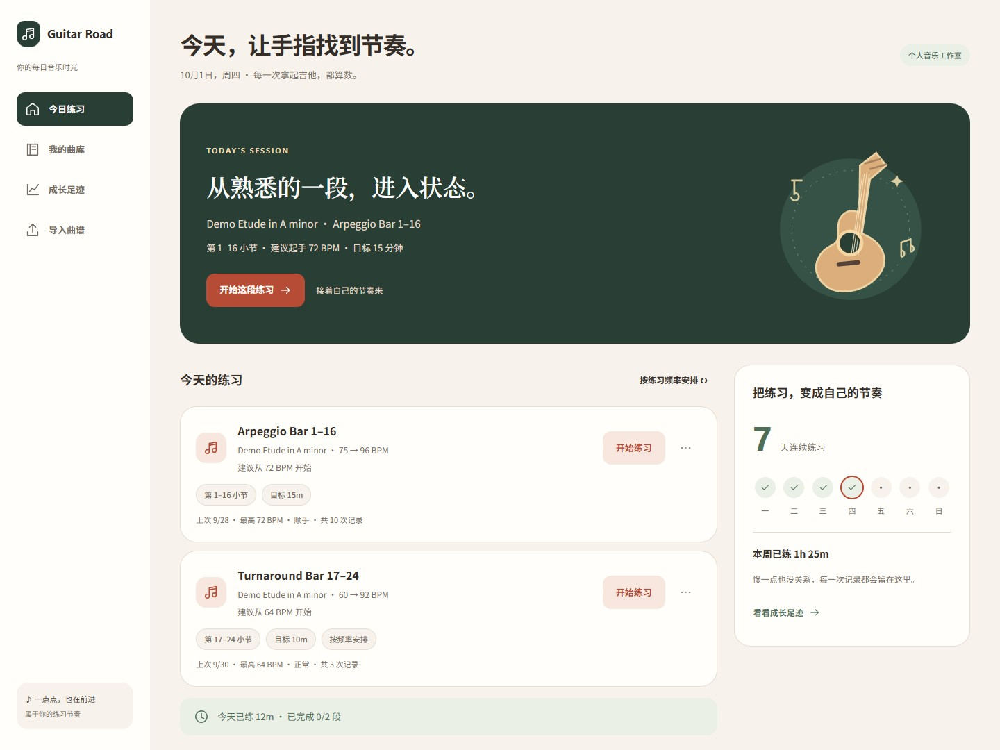
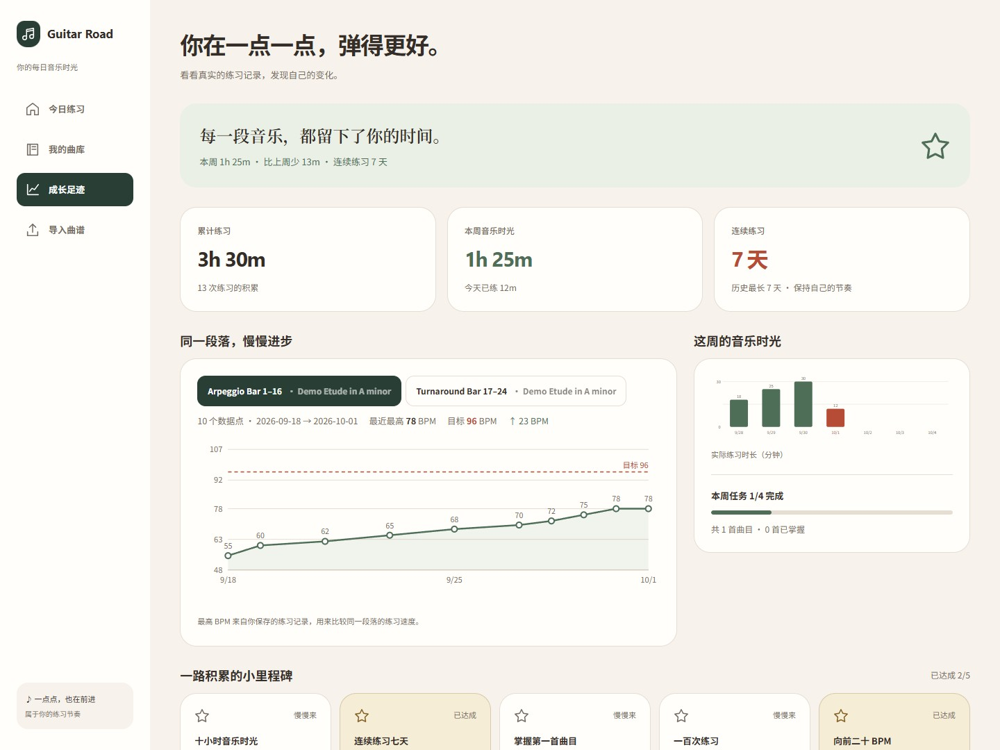
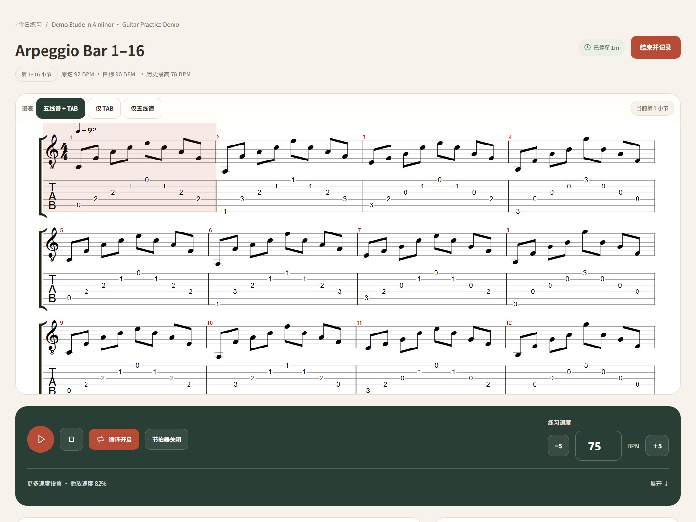

# Guitar Road · 每日音乐时光

一个本地优先的吉他练习工作台：从喜欢的曲目里选一小段，循环练习、逐步提速，记录属于自己的练习与成长。

目前是单用户本地应用，采用 Next.js、React、SQLite 和 alphaTab。界面以中文为主，支持桌面与移动布局。项目早期名称为 Guitar Practice，部分脚本和数据文件沿用旧名称。

## 能做什么

- 导入 Guitar Pro（`.gp` / `.gpx` / `.gp5` / `.gp4` / `.gp3`）和 MusicXML（`.musicxml` / `.xml`）；PDF 作为配套资料查看。
- 只要有 GP / MusicXML 就能**整曲播放**：不需要先建练习段落，也不会产生练习记录。
- 用**专辑**整理曲库（`曲库 → 专辑 → 曲目`，一层）；专辑与教材是两个维度，可同时存在，删除专辑不会删除曲目。
- 按轨道和起止小节建立练习段落，查看五线谱、TAB 或两者，播放与循环练习。
- 调整 BPM、播放速度与节拍器，使用逐档提速训练。
- 管理今日任务，完成、跳过、延期或按练习频率生成任务。
- 保存时长、起手/最高/结束 BPM、感受与笔记，在成长页查看练习趋势。
- **Creator（可选）**：把乐谱截图识别成 MusicXML 草稿，预览后下载，再用 Guitar Pro 校正。
- 提供 PWA manifest 和静态资源缓存；完整练习流程仍需要本地服务运行。

速度与练习成果来自用户记录，不是麦克风自动识别结果。当前没有云端同步、账户登录、制谱编辑器或 PDF 自动识谱。

Creator 的乐谱识别需要本机安装 Python 与 [homr](https://github.com/liebharc/homr)。**没有它们也能正常使用 Guitar Road**，Creator 页面会显示「识别引擎未安装」。

## 快速开始

需要 **Node.js 22 或更新版本**与 npm。首次安装需要联网，Python 仅用于可选的图标生成。

```bash
git clone https://github.com/zzhiyoung/guitar-road.git
cd guitar-road
npm ci
npm run dev
```

打开 [localhost:3000](http://localhost:3000)，导入曲谱，选择轨道与小节，创建练习段落即可开始。首次访问会自动创建数据库，无需手工执行迁移。

仓库内 `.npmrc` 使用 npmmirror。希望使用 npm 官方源时，可执行 `npm ci --registry=https://registry.npmjs.org`。

当前依赖附带运行产物，项目安装配置跳过依赖生命周期脚本；生产构建和启动命令仍正常执行。详情见 [开发说明](docs/DEVELOPMENT.md)。

### Windows 一键启动（日常使用推荐）

双击根目录的 [`launch-guitar-practice.bat`](launch-guitar-practice.bat)。它会检查 Node.js、在缺少依赖时安装依赖、在没有生产构建时构建，然后启动服务并打开浏览器。

- 启动后保留控制台窗口，关闭窗口即停止服务。
- 修改代码后执行 `launch-guitar-practice.bat rebuild`，让日常启动使用新版本。
- 桌面快捷方式需要手工创建：右键 BAT → 显示更多选项 → 发送到 → 桌面快捷方式，再在快捷方式属性中选择 `assets/icon.ico`。
- 默认使用 3000 端口和 `.next`。开发服务应先停止；端口占用、构建切换与验收方法见 [启动器维护说明](docs/LAUNCHER.md)。

macOS / Linux 或需要手工启动时：

```bash
npm run build
npm run start
```

当前 `next start` 默认监听所有网络接口。仅供本机使用时可执行 `npm run start -- --hostname 127.0.0.1`。应用没有认证，勿将服务直接暴露到公网。

### 可选演示数据

仓库不包含个人曲谱与练习记录。`scripts/seed-demo.mjs` 可生成一首原创 24 小节 MusicXML 练习曲、两个练习段落和演示记录。

在新安装、没有真实数据的目录中，先启动应用并访问一次首页，让数据库建表；然后停止服务并运行：

```bash
node scripts/seed-demo.mjs
npm run dev
```

该脚本会写入数据，重复执行会追加演示内容。`--reset` 会清空业务数据，只应在专用演示环境中使用。

## 界面预览

以下截图使用独立演示数据库生成，不含个人练习记录。

| 今日练习 | 成长足迹 |
|---|---|
|  |  |



## 数据与配置

默认数据库为 `data/guitar-practice.db`，上传资料保存在 `data/files/`，均不提交到 Git。备份前先停止服务，再复制整个 `data/`；恢复时同样先停服务。只备份数据库会丢失曲谱文件。

可将 [`.env.example`](.env.example) 复制为 `.env.local`，按需要配置：

| 变量 | 用途 | 默认值 |
|---|---|---|
| `GUITAR_DB_PATH` | SQLite 文件路径 | `data/guitar-practice.db` |
| `GUITAR_FILES_DIR` | 上传文件根目录 | `data/files` |
| `GUITAR_OWNER_NAME` | 首次创建用户时的显示名称 | `Guitarist` |
| `GUITAR_OWNER_EMAIL` | 首次创建用户时的邮箱 | 空 |
| `GUITAR_NEXT_DIST_DIR` | 独立构建输出目录 | `.next` |
| `GUITAR_ROAD_OMR_PYTHON` | Creator 使用的 Python 解释器 | 依次尝试 `python` / `py` / `python3` |
| `GUITAR_ROAD_HOMR_CMD` | 覆盖 homr 的调用方式（JSON 数组） | 自动探测 |
| `GUITAR_ROAD_HOMR_ARGS` | 额外透传给 homr 的参数（JSON 数组） | 无 |

独立输出目录用于开发或预览，启动器只支持默认 `.next`。Owner 配置影响首次创建的用户，不会自动改写已有记录。Node 直接运行的 seed 脚本不会自动加载 `.env.local`；使用自定义路径时需在终端设置环境变量。

## 可选的乐谱识别（Creator）

Creator 把「截图 → MusicXML → Guitar Pro」这条链路跑通，用于减少手工录谱时间，不替代 Guitar Pro 修谱。

```bash
cd tools/omr

# 建议用独立 venv（Python 3.10-3.12），不要把 homr 装进系统环境
python -m venv .venv
.venv/Scripts/python -m pip install setuptools wheel poetry-core

.venv/Scripts/python -m pip install -e .
.venv/Scripts/python -m pip install "homr[cpu]"

.venv/Scripts/python -m guitar_road_omr status     # 验证
```

然后在项目根目录的 `.env.local` 里指向这个解释器，Creator 才能找到它：

```
GUITAR_ROAD_OMR_PYTHON=D:/coding/Guitar Road/tools/omr/.venv/Scripts/python.exe
```

模型权重（约 140 MB）来自 GitHub Releases，国内直连很慢，
[tools/omr/README.md](tools/omr/README.md) 里有镜像下载与常见问题。

识别在本机完成，图片不会上传到任何服务器；每次任务使用独立临时目录并在结束后清理。识别结果只是草稿，下载后用 Guitar Pro 校正，再从「导入曲谱」加入 Guitar Road。完整说明见 [tools/omr/README.md](tools/omr/README.md)。

## 文档与贡献

- [文档索引](docs/README.md)：当前文档与产品规划的边界。
- [开发说明](docs/DEVELOPMENT.md)：目录、数据模型、alphaTab 集成与验证流程。
- [OMR sidecar](tools/omr/README.md)：Creator 的可选识别引擎与安装方式。
- [启动器维护](docs/LAUNCHER.md)：桌面快捷方式、图标、已知限制与三条验收路径。
- [产品规格](docs/SPEC.md)：初始规划，包含尚未实现的目标。
- [贡献指南](CONTRIBUTING.md)：修改与提交约定。

```bash
npm run typecheck
npm run build
```

## 许可证

项目原创代码与文档采用 [MIT License](LICENSE)。随项目分发的 alphaTab、Bravura 字体与 Sonivox 音源保留各自许可证，详见 [第三方声明](THIRD_PARTY_NOTICES.md)。用户自行导入的曲谱、PDF 与个人数据不属于项目开源内容。
